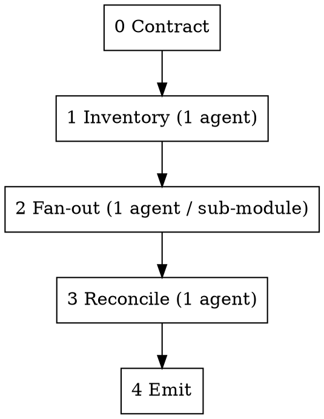

# WBS Breakdown (parallel agents → trackable agile backlog)

## Overview

Decompose a mockup- or spec-based system into a **trackable agile WBS**: Module → Sub-module(Epic) → Screen → User Story / Enabler Task, each with acceptance criteria and a Fibonacci story point. Parallel subagents do the breakdown; an inventory phase guarantees completeness and a reconciliation phase guarantees consistency.

**Core principle:** the WBS captures the **what & why** (value, acceptance criteria, estimate). It stops there. The team owns the **how** (APIs, components, sub-tasks). Cross this line and the backlog goes stale and demotivates devs.

**REQUIRED SUB-SKILL:** Use superpowers:dispatching-parallel-agents for the fan-out mechanics.

## When to use

- A new system / module must be turned into a sprint-plannable backlog.
- You have UI mockups or a spec and need user stories + story points that are consistent across the whole system.
- Someone needs assurance that **no screen or feature was missed**.
- Output must import cleanly into Jira (Epic → Story/Task).

Do NOT use for: re-estimating a single known story, or writing implementation tasks (that's the dev's job).

## The PM boundary (the one judgment that matters)

| WBS produces — the *what & why* | Dev owns — the *how* |
|---|---|
| Module → Sub-module(Epic) → Screen | Sub-tasks (their own breakdown) |
| User Story / Enabler Task | API & data design, components |
| Acceptance criteria, points, roles, mockup ref, notes, deps | Implementation |

No FE/BE split (fullstack team → vertical slices). No `technical_notes` dictating endpoints/components. No sub-tasks. See `references/schema.md`.

## Orchestration

1. **Contract** — load `references/decomposition-contract.md`. This is handed **verbatim** to every fan-out agent. Never paraphrase it.
2. **Inventory** — ONE agent parses ALL mockups → authoritative list of every screen, its sub-screens (UI regions), roles, and a stable ID. This is the backbone that prevents missed features (the "M3 was empty" failure).
3. **Fan-out** — ONE subagent **per sub-module** (not per screen — siblings seen together = higher local consistency, fewer merges). Each gets: the contract + the anchor set + its assigned screens from the inventory + the mockup content for those screens. Each owns its `M{n}.{m}` ID prefix → zero collisions. Each emits stories/enablers with AC, points, intra-module `dependencies`, and `external_deps` flags for anything it needs from outside its sub-module (it is blind to other modules — see below).
4. **Reconcile** — ONE agent that sees everything: re-level points against the global anchors, dedupe cross-cutting stories (promote shared ones to Enablers), **resolve every `external_deps` into a concrete cross-module `dependencies` id** and detect cross-module blockers the blind fan-out agents couldn't (see Cross-module dependencies below), run the **100%-rule coverage check** (every screen + sub-screen in the inventory has ≥1 item, else flag), validate schema + IDs + Fibonacci-only points + **dependency cycles**.
5. **Emit** — write the WBS JSON (`references/schema.md`), regenerate the mindmap HTML, output a QA report: per-module totals, point histogram, coverage gaps, flagged outliers, and the **cross-module dependency map** (`node build.mjs` prints all of these, including unresolved `external_deps` and cycles).

## Cross-module dependencies & blockers (the parallel-agent blind spot)

Fan-out agents each own one sub-module and run in parallel, so **none of them can see a dependency that crosses module boundaries** — e.g. *People's utilization KPI is fed by workload owned by the PM module.* If you rely only on fan-out, these blockers are silently lost.

The fix is a two-step protocol:

1. **Fan-out flags, never guesses.** When an agent senses a need it can't satisfy from its own sub-module, it emits an `external_deps` entry (`{ needs, likely_module?, reason }`) instead of inventing a dependency id or building the capability itself.
2. **Reconcile resolves.** The reconcile agent — the only one with the whole map — turns each `external_deps` into a real cross-module `dependencies` id (or creates the missing enabler, or flags a coverage gap), AND proactively scans for implicit cross-module links the agents missed (workload, allocation, utilization, headcount, permissions, audit, notifications usually cross modules). It then runs cycle detection.

The validator (`wbs/lib/schema.mjs`) enforces the outcome: a leftover `external_deps` is a warning ("reconcile didn't finish"), an unresolvable `dependencies` id is a warning, and a dependency **cycle is an error**. The map renders cross-module blockers in red and counts them in the header.

## Consistency engine (why parallel agents don't drift)

1. **One contract, injected verbatim** into every subagent — identical decomposition rules.
2. **Reference-story anchors** — agents estimate **by analogy** to known 1/2/3/5/8 examples, not from scratch. See rubric below and `references/decomposition-contract.md`.
3. **Uniform story template + INVEST + SPIDR splitting** → same granularity everywhere.
4. **Deterministic ID namespacing** → clean merge.
5. **Reconciliation pass** → the one place that levels global drift and proves completeness.

## Story point rubric (anchored to the calibrated baseline)

| SP | Meaning | Anchor example |
|----|---------|----------------|
| 1 | Trivial single action / system side-effect | "Click an employee row to open their profile drawer" |
| 2 | Scoped variation of an existing capability (mostly reuse) | "View account-scoped workforce metrics as AM" |
| 3 | **Default** — one standard view/action, a few elements | "View company-wide KPI strip"; "Acknowledge my review" |
| 5 | Richer analytical view or multi-field edit; moderate logic | "Identify skill gap & critical roles"; "Edit employee manager/account/grade" |
| 8 | Multi-step workflow with side-effects/integration or many-dimension scoring — **candidate to split** | "Create account + provision MS365 + invite"; "Evaluate a team member across weighted pillars" |
| 13 | Too big — **must split** before estimating | — |

Fibonacci only: 1, 2, 3, 5, 8, 13. Healthy distribution centers on 3.

## Common mistakes

- **Per-screen fan-out by default** — over-fragments; reconciliation work explodes. Use per-sub-module.
- **Skipping the inventory phase** — guarantees missed screens. It is the completeness backbone.
- **Writing implementation tasks** (FE/BE, endpoints, components) — violates the PM boundary; the dev derives these from the mockup.
- **Estimating from scratch** instead of by analogy to anchors — causes cross-agent point drift.
- **Letting an 8 through unexamined** — always ask "can this split?" before accepting it.
- **Non-Fibonacci points** (4, 6, 7) — reconcile rejects these.
- **Expecting fan-out agents to find cross-module blockers** — they're blind across modules. They flag `external_deps`; reconcile resolves. Skipping this loses real blockers.
- **A fan-out agent guessing a dependency id from another module** — forbidden; it must use `external_deps` so reconcile can resolve it correctly.

## Reference files

- `references/schema.md` — the locked WBS JSON schema + field definitions + ID scheme.
- `references/decomposition-contract.md` — the verbatim instruction set handed to every fan-out subagent.
